# 咸鱼音乐

    
    
    
    
    

## 下载

|   系统    |                          GitHub                           |
|:-------:|:---------------------------------------------------------:|
| Android | [Release](https://github.com/xianyvbang/XyMusic/releases) |

## 支持服务及版本

- [x] Jellyfin 10.10.7及以上
- [x] Emby 4.1.1.0及以上
- [x] Subsonic 1.16.0及以上
- [x] Navidrome 0.56.1及以上
- [x] Plex 4.1.1.0及以上

## 支持的功能

|  功能  | Jellyfin | Emby | Subsonic | Navidrome | Plex |
|:----:|:--------:|:----:|:--------:|:---------:|:----:|
| 内嵌歌词 |    ✅     |  ✅   |    ✅     |     ✅     |  ✅   |
| 外置歌词 |    ✅     |      |          |     ✅     |  ✅   |
| 在线歌词 |    ✅     |  ✅   |          |           |      |
| 歌手信息 |    ✅     |  ✅   |    ✅     |     ✅     |  ✅   |
| 专辑信息 |    ✅     |  ✅   |    ✅     |     ✅     |  ✅   |
| 音乐信息 |    ✅     |  ✅   |    ✅     |     ✅     |  ✅   |
| 收藏功能 |    ✅     |  ✅   |    ✅     |     ✅     |  ✅   |

## UI展示

### 实现多数据源连接

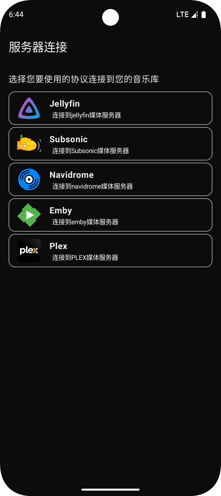

### 首页

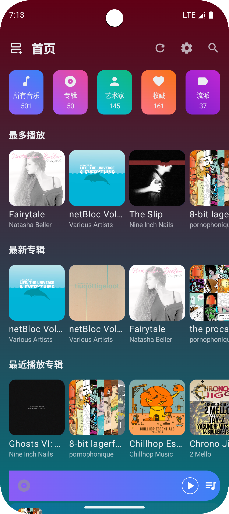

### 播放页面

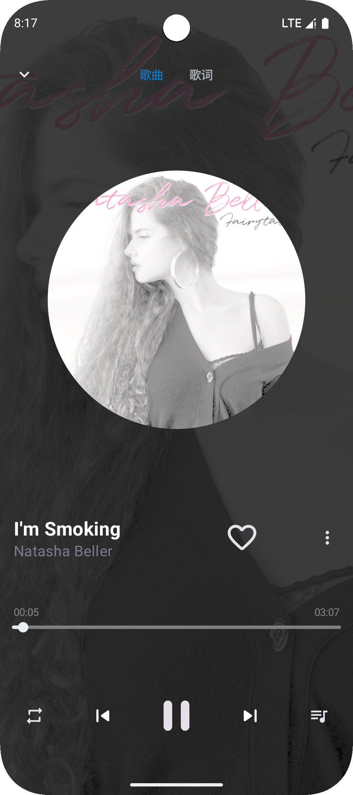

### 设置页

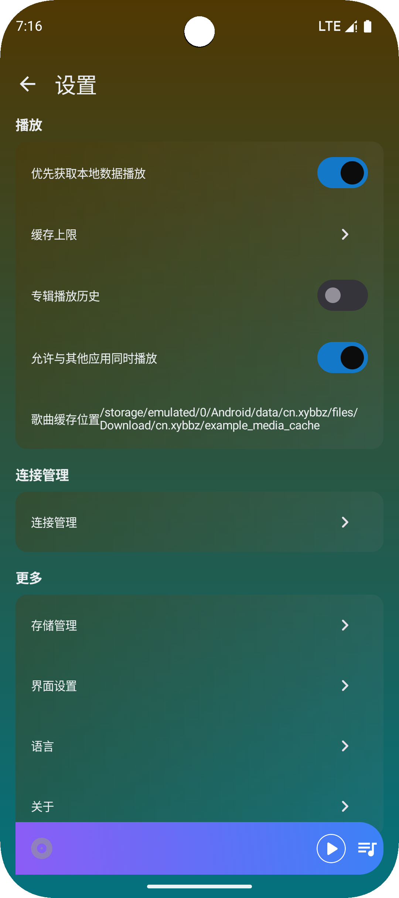

### 搜索页

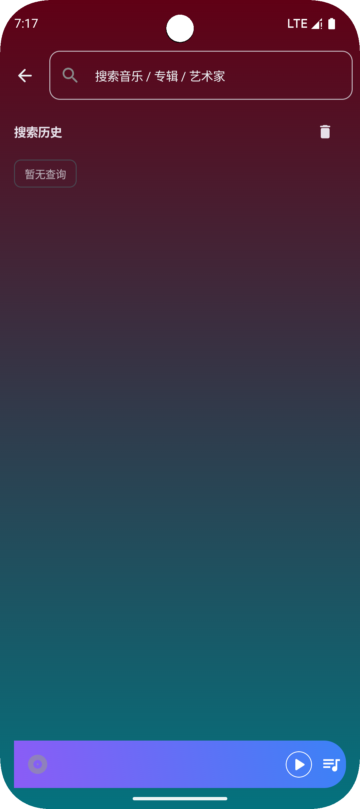

### 音乐列表页

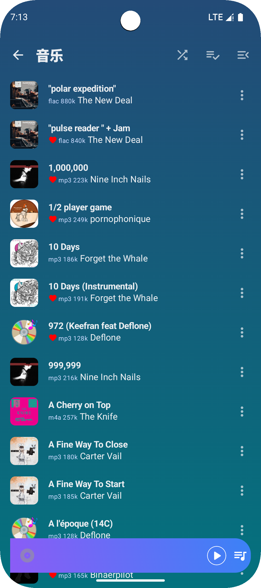

### 专辑列表页

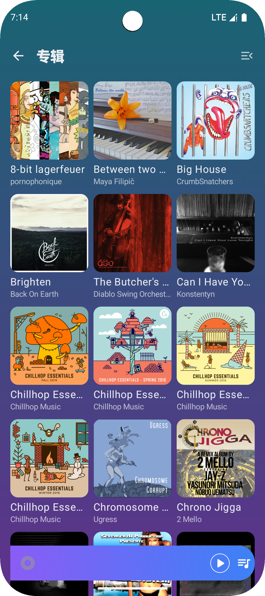

### 专辑详情页

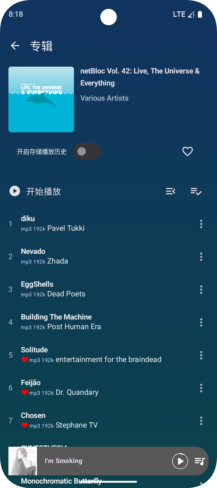

### 艺术家列表页

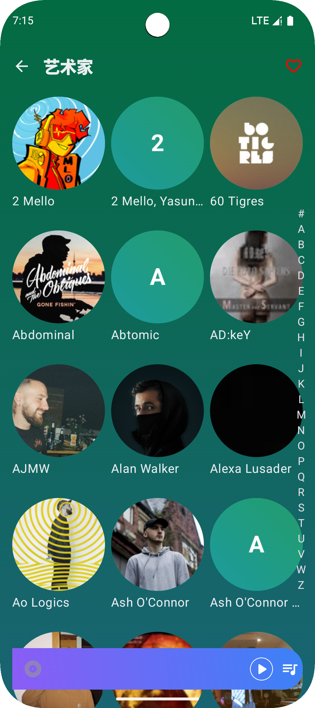

### 艺术家详情页

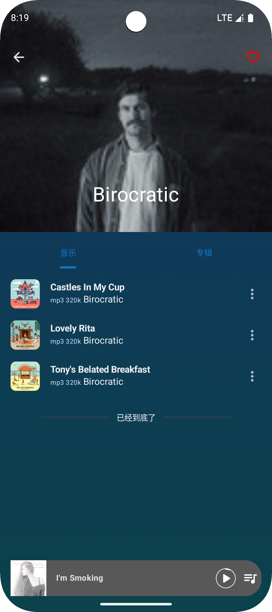

### 收藏页面

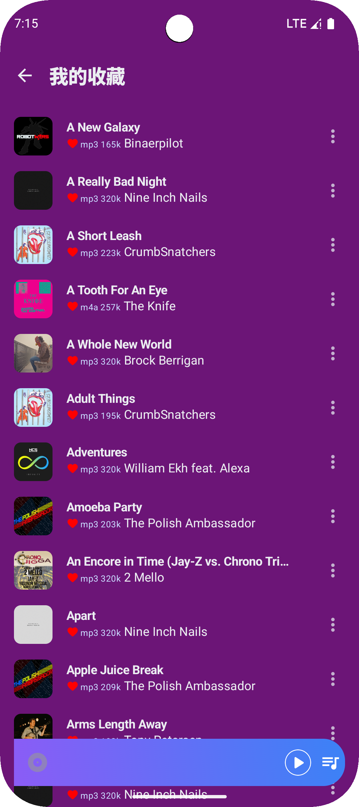

### 流派页面

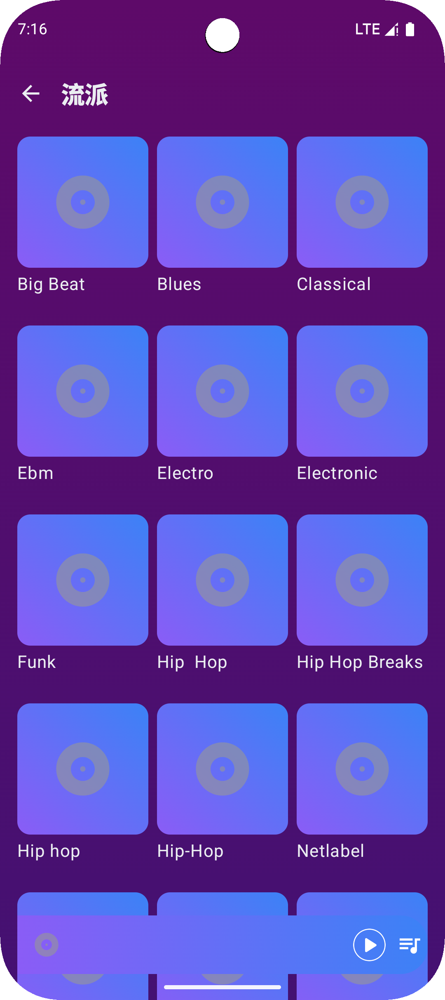

## 技术提示

- UI框架使用[Jetpack Compose](https://developer.android.com/develop/ui/compose/documentation?hl=zh-cn)
- 音乐播放器使用[Media3](https://github.com/androidx/media)
- 使用[Hilt](https://developer.android.com/training/dependency-injection/hilt-android)进行进行依赖注入
- 使用[MultiLanguages](https://github.com/getActivity/MultiLanguages)进行多语言管理
- 颜色选择使用[ColorPicker](https://github.com/skydoves/colorpicker-compose),
- 数据存储使用[Room](https://developer.android.com/training/data-storage/room)
- 分页列表加载使用[Paging3](https://developer.android.com/topic/libraries/architecture/paging/v3-overview)
- 跳转页面使用[Navigation](https://developer.android.com/guide/navigation)
  

## 感谢开源项目

[SaltUI: 衍生自Salt Player的部分 UI 组件](https://github.com/Moriafly/SaltUI)

[Media3](https://github.com/androidx/media)

[Coil](https://github.com/coil-kt/coil)

[Moshi](https://github.com/square/moshi)

[DialogX](https://github.com/kongzue/DialogX)

[Retrofit](https://github.com/square/retrofit)

[OkHttp](https://github.com/square/okhttp)

[Room](https://github.com/androidx/androidx/tree/androidx-main/room)

[ColorPicker](https://github.com/skydoves/colorpicker-compose)
[MultiLanguages](https://github.com/getActivity/MultiLanguages)

## 使用的免费图片

[歌曲列表默认封面 作者: OpenClipart-Vectors](https://pixabay.com/zh/vectors/cd-music-audio-notes-mp3-sound-158817/)

[播放详情默认图片 作者: OpenClipart-Vectors](https://pixabay.com/zh/vectors/disc-record-retro-vinyl-audio-158357/)

## 当前问题和未实现功能

|         BUG          | 备注 |
|:--------------------:|:--:|
|   增加一个片头片尾跳过的列表功能    |
|        淡入淡出功能        |
| 音乐跳转位置的时候缓存也跳转位置进行缓存 |
|      清理代码,增加注释       |
